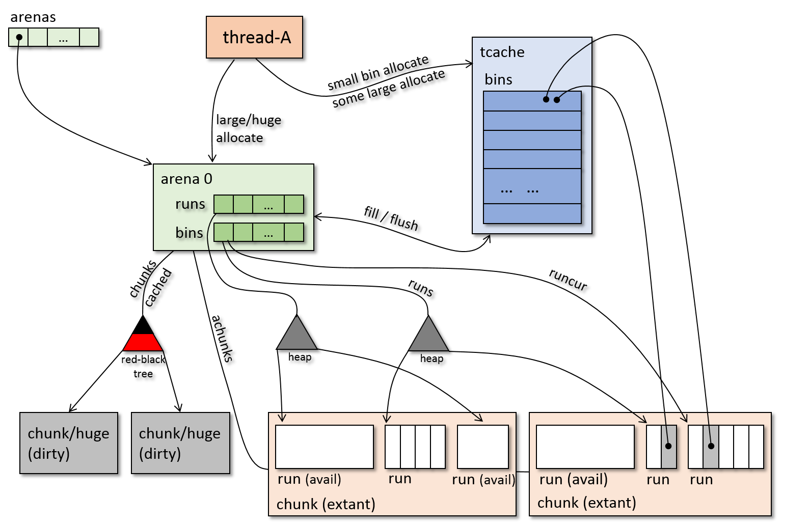

## 总体架构
jemalloc 有五个重要的数据结构：arena, bin, chunk, run, tcache 。

这五个数据结构可以分为三类：
* 物理布局相关：chunk, run
* 中央管理相关：arena, bin
* 线程本地缓存：tcache

chunk：jemalloc 向操作系统获取内存是以 chunk 为单位的，默认chunk为2M，
相当于 jemalloc 每次从操作系统“批发”一个 chunk 的内存。

run：jemalloc 从操作系统获取一个chunk的内存后，会将 chunk 切分成 run 
进行管理。

arena：jemalloc 的中央管理器，其管理着 jemalloc 的 chunk，包括释放掉的 chunk
以及正在使用的 chunk，对于正在使用的 chunk，arena 会将其切分成 run 进行管理。

bin：jemalloc 中央管理器的子管理器，即 arena 的次级管理器，负责 small bin 
的分配，从 arena 申请 run，并将 run 划分成 region 进行实际的 small 分配。

tcache：从属于某个线程的缓存分配器，tache 按照策略从 arena/bin 中获取一定数量
的 small bin 及 部分 large 放在本地缓存，线程的大部分申请都是从 tcache 中获取，
大部分释放都是放回 tcache，tcache 也会按照某种策略将部分缓存放回 arena/bin。

上图体现了 jemalloc 中的一些重要数据结构和重要工作流程，下面做一些解释：
* 每个线程会和 2个 arena 绑定(为了方便，图中画了一个)，一个用于 application
内存分配，一个用于 internal 内存分配，不过目前 internal 数据 主要分配在 base 和
arena 0 中，并没有用到 internal 绑定的 arena
* 每个 arena 会被多个线程使用，这个取决于线程的数量和CPU核数
* 每个线程有一个自己的 tcache，tcache中会缓存所有类型的 small bin 和 
少数几类 large，其并不是真的缓存，而是保存指向内存的指针，被缓存的内存会在 run 
或者 chunk 中标记为已经分配
* 线程申请属于 tcache 范围内的内存时，首先从 tcache 中获取，如果 tcache 中有，
则直接获取，没有的话，如果是 small，则 tcache 从 arena 中获取内存来填充，再分配
给线程，如果是 large，则 线程 重新向 arena 申请
* tcache 会根据策略，选择时机向 arena 释放内存(flush)，或者从 arena 获取内存填充
bin (fill)
* 线程申请不属于 tcache 的 large 时，或者申请 huge 时，直接向 arena 申请
* arena 使用红黑树管理脏的 chunk/huge (被释放的 chunk/huge)，实际 arena 使用多棵
红黑树管理被释放的 chunk/huge，用于不同的用途，这里只画了一颗
* arena 对可用的 runs 进行分组管理，每一组使用 堆 维护
* arena 中对多组 bin 管理，bin 内部使用 堆 对自己的 run 管理
* arena 中的 achunks 使用 链表 维护正在使用的 chunk
